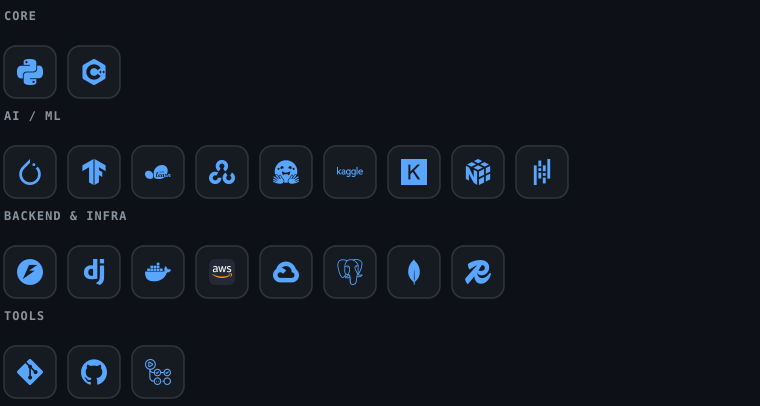
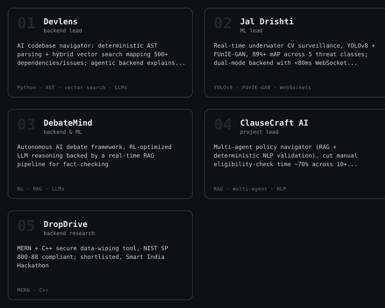

<div align="center">



</div>

---

### `> whoami`

```python
har_agam = {
    "role"      : "second-year B.Tech CSE, Maharaja Agrasen Institute of Technology (GGSIPU)",
    "cgpa"      : 8.46,
    "focus"     : ["ML/DL", "Generative AI", "backend systems", "adversarial ML", "mech interp"],
    "leads"     : "backend & ML dev @ BYTE Society (2024 – present)",
    "seeking"   : "AI/ML or GenAI internship — research-driven engineering, real problems",
}
```

---

<div align="center">


<sub>live network, regenerated daily — <b>the hidden layers grow or shrink with how much I committed that day</b>, and what you're watching is an actual forward pass, not a loop of random flashes</sub>

</div>

---

### `> stack`



---

### `> telemetry`

<div align="center">


</div>

---

### `> currently`

```python
now = {
    "building" : "multi-agent + adversarial ML systems",
    "reading"  : "mech interp papers",
    "goal"     : "land an AI/ML or GenAI internship, ship something that outlasts the semester",
}
```

---

### `> pinned.projects`

<div align="center">



[](https://github.com/haragam22/debatemind)
[](https://github.com/haragam22/devlens)
[](https://github.com/haragam22/jal-drishti)
[](https://github.com/haragam22/sonic_script)
[](https://github.com/haragam22/DATATHON-2026)
[](https://datathon-2026-60076596887.development.catalystserverless.in/app)
[](https://github.com/haragam22/galla-sathi)
[](https://galla-sathi.vercel.app/)

</div>

---

### `> achievements`

```python
achievements = [
    "Winner — Smartohack 3.0, R&D Dept MAIT (2026)         : Jal Drishti",
    "1st Runner-Up — VisionX Hackathon, GfG/HackBriven (2026): Devlens",
    "Winner — Verdict, Cognizance IIT Roorkee (2025)        : national debate",
    "Winner — Founder's Gambit, E-Summit IIT BHU (2024)     : national business comp",
    "1st Runner-Up — Research Quest, Research Society MAIT (2025)",
]
```

---

### `> contact.init()`

<div align="center">

[](https://www.linkedin.com/in/haragam-deep-singh)
[](mailto:haragam.22@gmail.com)
[](https://github.com/haragam22)
[](https://www.kaggle.com/haragamdeepsingh)
[](https://raw.githubusercontent.com/haragam22/haragam22/main/resume.pdf)

</div>

<div align="center">
<sub><code>// backend by day, gradients by night</code></sub>
</div>

---

<div align="center">

</div>
